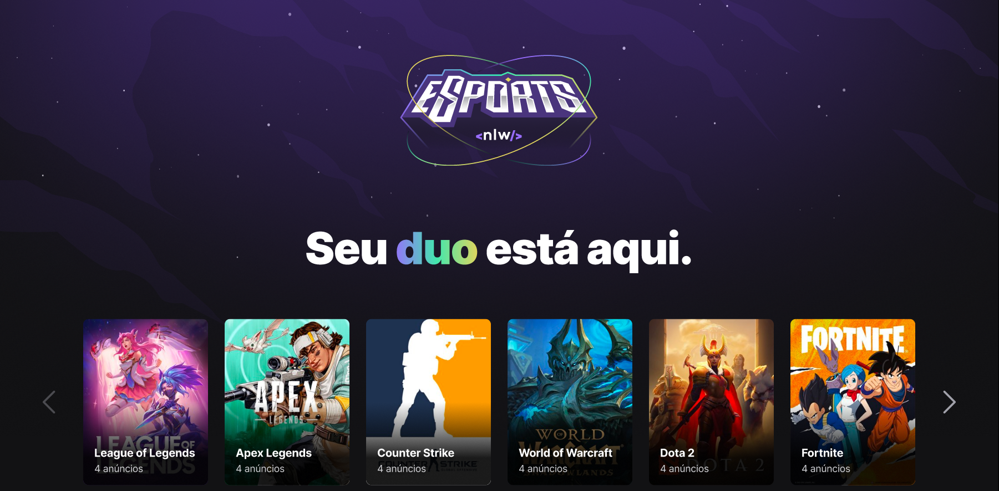

# NLW - eSports (Frontend)



Aplicação web desenvolvida durante o evento NLW - eSports organizado pela [Rocketseat](https://github.com/Rocketseat). A aplicação tem como objetivo conectar pessoas que jogam o mesmo game e possuem a mesma disponibilidade de horário.

Nessa aplicação é mostrado os jogos que estão disponíveis e a quantidade de anúncios que possui em cada jogo. Além de poder publicar um anúncio próprio, informando o jogo que está interessado, disponibilidade de horário, e até tempo em que joga o game. Cada anúncio se refere a uma pessoa que adicionou seu interesse no game.

- OBS: A aplicação ainda não está em produção, por isso, só pode ser utilizada localmente. Sendo necessário um backend próprio, que está disponível [nesse repositório](https://github.com/OJailson17/nlw-esports-backend).

## **Como rodar a aplicação**

Com o projeto já disponível em sua máquina basta rodar o comando:

```bash
yarn install
```

Após a instalação dos pacotes, é só rodar o comando:

```bash
yarn dev
```

- O backend precisa estar rodando para realizar as buscas e publicar os anúncios.
